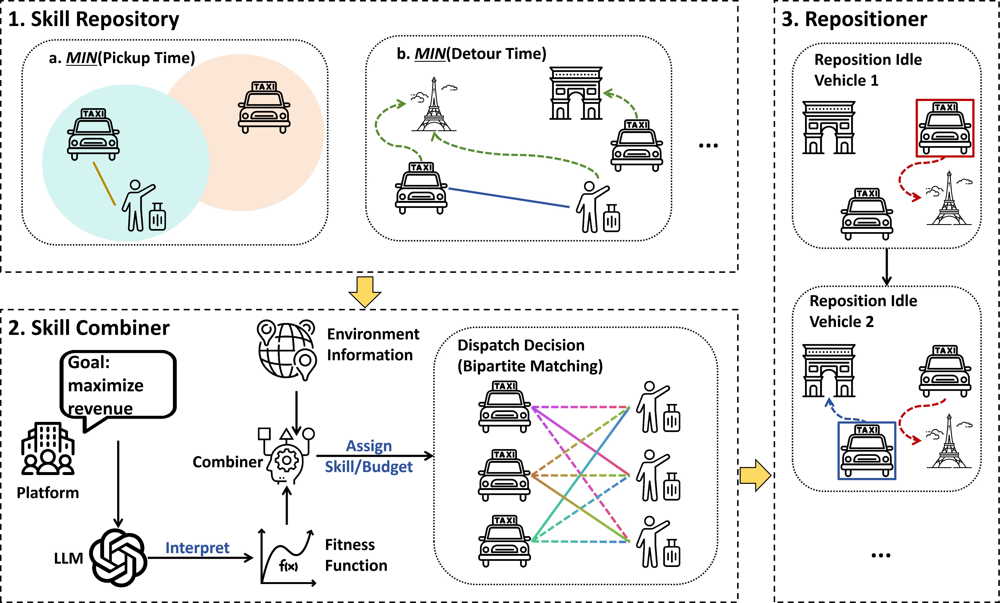
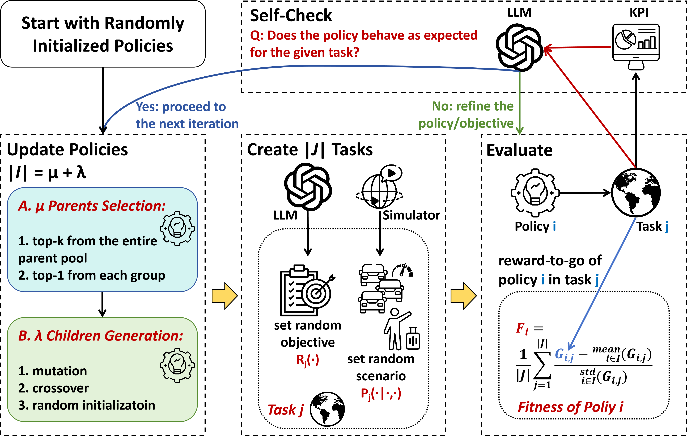

# RideSkill

Article: "RideSkill: A Hierarchical Algorithm for Generalized Ride Sharing with LLM-Driven Automatic Evolution" (under review)






## Requirements

RideSkill is built on top of the RideGym simulator, which is distributed
separately on PyPI:

```bash
pip install ride-gym
pip install -r requirements.txt
```

Python ≥ 3.9, No GPU is needed

## Repository layout

```
pref_dispatch/            RideSkill core
  skills.py               handwritten seed skills + skill interface
  combiner.py             combiner interface (skill blending)
  reposition.py           repositioner (sequential idle-vehicle relocation)
  matching.py             softmax + budget + greedy matching
  evaluate.py             rollout loop (phi_ep / phi_step contexts, w on phi_ep)
  llm/                    the three evolution phases + prompts + sandbox
    run_phase1_full.py    Phase 1: evolve the skill repository
    run_phase2_full.py    Phase 2: evolve the objective-reading combiner
    run_phase3_full.py    Phase 3: evolve the repositioner
    prompts/              all prompt builders (verbatim in the paper appendix)
  evolved/                FROZEN artifacts of our best run (ready to test)
    skills/               10 evolved skills (+3 handwritten seeds in skills.py)
    combiners/            objective_shape_dispatcher_r4 (the paper's combiner)
    repositioners/        dualmech_od_reach_hybrid_scorer
data/nyc/                 Manhattan road network + preprocessed NYC FHVHV
                          order windows (train/test splits included)
examples/quick_test.py    load the frozen stack and roll one episode
```

## Data

`data/nyc/` ships the Manhattan road network and the preprocessed NYC FHVHV
order windows used in the paper. The raw trip records are public data from the NYC Taxi & Limousine
Commission; the preprocessing scripts are part of the RideGym package. 

Due to the copyright, please process the data follow [RS2002/RideGym: Official Repository for The Paper, RideGym: A Standardized Interface for Real-World Large-Scale Ride-Sharing System](https://github.com/RS2002/RideGym) and put the processed data in `data/nyc/` .

## Quick test (no LLM needed)

The frozen artifacts are included, so the trained stack can be evaluated
immediately:

```bash
python examples/quick_test.py
```

This loads the skill repository, the frozen combiner and repositioner, rolls one
full held-out NYC hour (fleet = 1,000, capacity = 4), and prints the KPI summary
(reward, service rate, completion rate, wait / ride / detour minutes,
utilisation).

To hand the stack a *custom objective*, wrap any per-step reward function and
pass it as `w` — see `examples/quick_test.py` for the pattern:

```python
w = lambda event: my_reward(event)          # any additive per-event price list
factory = make_pref_factory(pref, combiner_name="objective_shape_dispatcher_r4",
                            repositioner=rep, reward_fn=w)
```

The combiner probes `w` on synthetic events at runtime and re-routes the fleet —
no retraining.

## Training (reproduce the evolution)

Training requires an LLM endpoint. Set the API key in the environment (or in a
git-ignored `.env`); the client reads `API_KEY` and speaks the
OpenAI-compatible chat API (the model name is set in
`pref_dispatch/llm/config.py`):

```bash
export API_KEY=sk-...
```

The three phases run in order; each freezes its artifact before the next starts:

```bash
# Phase 1 — skill repository (directed niches + QD self-invention)
python -m pref_dispatch.llm.run_phase1_full \
    --scenarios 6 --generations 5 --max-skills 10 --workers 8 --run-tag myrun

# Phase 2 — objective-reading combiner (probe-event evolution)
python -m pref_dispatch.llm.run_phase2_full \
    --generations 8 --min-gen 4 --patience 3 --workers 8 \
    --probe-event-evolve --run-tag myrun

# Phase 3 — repositioner (fairness-strength-tripled cells)
python -m pref_dispatch.llm.run_phase3_full \
    --cells 18 --generations 8 --min-gen 4 --patience 3 --workers 8 \
    --run-tag myrun
```

Each run writes per-generation leader checkpoints under `cache/` so an
interrupted run can be resumed (`--resume RUN_TAG`), and freezes the final
champion under `pref_dispatch/evolved/`.

Offline sanity checks (no API key needed) validate every signature and pipeline
end-to-end:

```bash
python -m pref_dispatch.llm._verify_partB
```


## Citation

```

```

